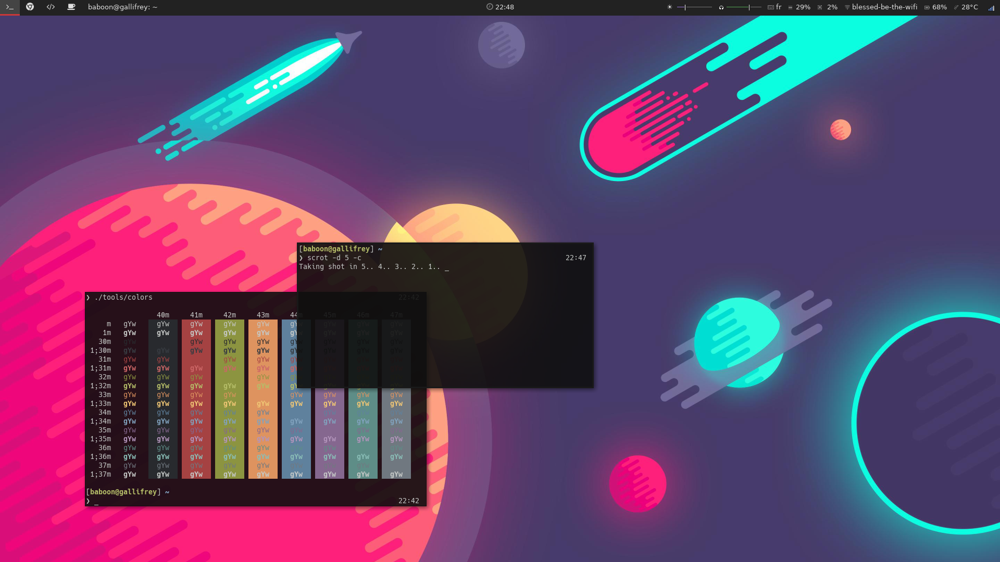

# .dotfiles

Configuration file for pretty much everthing. Desktop environment based on Archlinux, zsh, i3vm, polybar, rofi and termite.

Some configuration might need extra dependencies: 
* i3lock-color
* ttf-unifont
* ttf-hack
* ttf-font-awesome
* siji-git 
* oh-my-zsh
* vim-colors-solarized

## I3 Cheat sheet

In addition to usual keybinding here is some usefull extra: 

| Shortcut | Description |
| --- | --- |
| $mod+Ctrl+Left | Switch to previous workspace |
| $mod+Ctrl+Right | Switch to next workspace |
| $mod+Shift+Return | Open a floating terminal |
| $mod+Tab | Open window switcher |
| $mod+Shift+s | New ssh connection  |
| $mod+x | Open a console file manager |
| $mod+Shift+x | Open a graphical file manager |
